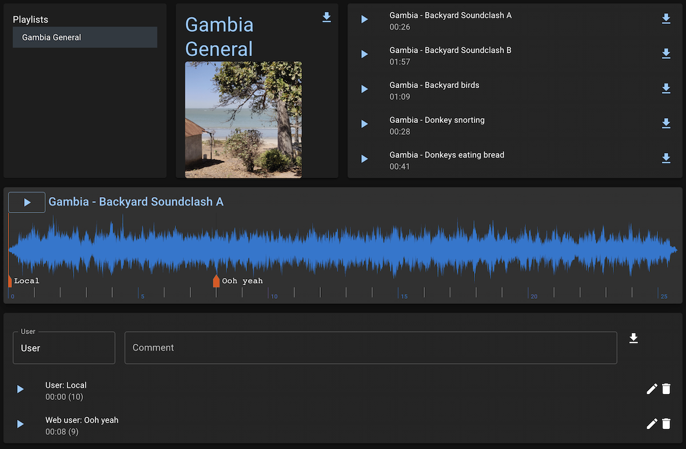

# Static Audio

This is intended as a static site version of Soundcloud etc. It can be run as a simple static site - just HTML and JS files served from any old webserver. It can also do live comments, but this requires being served from a Node server for the comment backend. 

It currently looks like this:


Features:
- Can run as a completely static site - pure HTML and JS, serving a directory of mp3/wavs
- If run as a server, supports realtime comments, timestamped to the track
- Artwork per playlist
- Download of tracks and playlists
- Additional information set with JSON files - no databases etc.
- Run locally, deploy to remote machine
- Download comments in a CSV file ready for Reaper (for collaborative discussion of mixes etc.)

## Docs need updating after refactor...

## Setup

If you put folders full of mp3/wav files into `static-audio-client/public/media`, and then run
```
yarn shared run index
```
It will create a JSON index of all the audio, ready to serve.

Note: currently, you need to symlink this in `shared/public/media`, but this should get fixed in the future.

## Running locally 

```
yarn client start
```

Starts a static server (port 3000), sharing what is in `static-audio-client/public/media`

```
yarn server start
```
Starts a dynamic server (port 5000), sharing the same directory, but allowing realtime comments. (Note, may require `yarn client build` first)


## Deploying - Static
Running `yarn client build` will create a build directory with everything that you need in there.

This can then be served using e.g. nginx, simply by creating a server, e.g.:
```
server {
        listen 8080;

        root <wherever you put it>;
        index index.html index.htm index.nginx-debian.html;

        server_name <your server names>;

        location / {
                try_files $uri $uri.html $uri/ /index.html =404;
        }
}
```

Then you can copy everything across with
```
rsync -v -e ssh -aqr static-audio-client/build/ <user>@<host>:<wherever you put it>
```

Once this is done the first time, you should be able to:
- Update the code without touching the files
```
//TBC, but something with excluding public/media from the rsync
rsync -v -e ssh -aqr --exclude 'static-audio-client/public/media' static-audio-client/build/ <user>@<host>:<wherever you put it>
```
- Update the music files without changing the code
```
//TBC, but something like
npm run index_files
rsync -v -e ssh -aqr static-audio-client/public/media/ <user>@<host>:<wherever you put it>/public/media
```

## Deploying (dynamic)
TBC

## Details

Running `yarn shared run index` creates an index of all the files in the media directory called `playlists.json`. This is the basis that the client uses to show a list of playlists, and the tracks within each one. To update the set of files is a case of re-indexing, and then uploading the new `playlists.json` and audio files to the server.

### Artwork

If a folder has a file called `Artwork.jpg` this will be used as the artwork for the playlist.

### Comments
If a server is used, the client makes a websocket connection to it to send data about comments. The server uses [Node Persist](https://github.com/simonlast/node-persist) to store them. Comments are timestamped based on current playback position.

The download button on the comments pane downloads them as a CSV file set up for Reaper. Using the Import Regions/Markers command should work, but it hasn't been tested much, and special characters may be a problem.

### JSON Files
If a directory has a `playlist.json`, this will be used to describe what is in there, in order to allow ordering of tracks or naming beyond file names. Example:
```
{
    "name": "Kayak Trip from Playlist", // Set name of playlist
    "id": "KayakTrip",                  // Unique ID
    "tracks": [                         // Ordered list of tracks
      {
        "url": "/Kayak Trip/KayakTrip - Laughing bird and seaguls.mp3",
        "name": "Laughing bird and seaguls", // Name for the track
        "length": "00:47"
      },
```
The easiest way to start is to generate the whole `playlists.json` file, and then copy/paste the relevant bit into a new file and edit that.

### Zip Files

The index command creates zip files of each directory to allow easy downloading. This probably should be configurable...

## Roadmap/Development
- Comment editing and better time setting
- Set up top level scripts and document; with some deployment scripts
- Allow config of media directory and allow media directory outside project DIR
- Maps between marker times to allow for edits/changes to files
- Flag to choose whether to make/update zip file

## Bugfix
- [ ] Debug waveform pre-creation - at the moment, seems to stop it from loading
- [ ] Manage playing better - move to next track at end, start playing on selection of new track if already playing (or always?)
